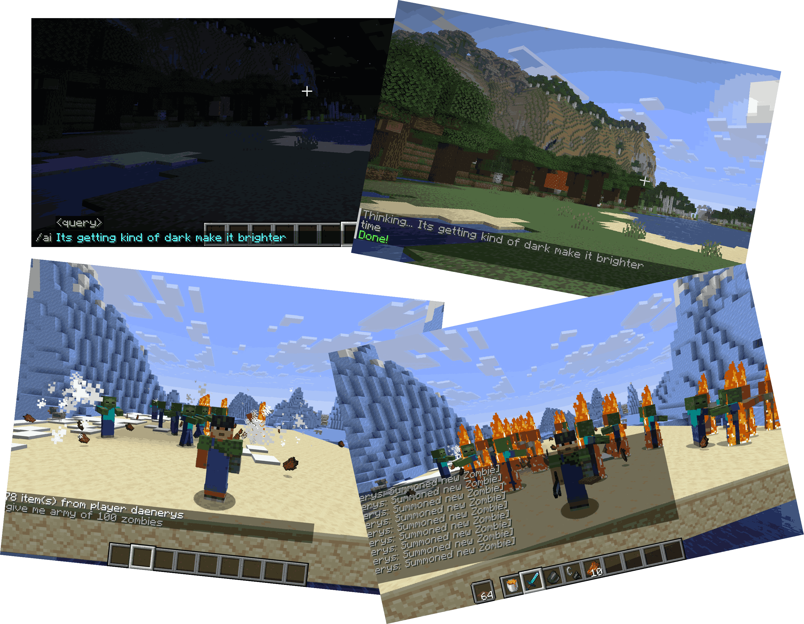

# SpellCraft Mod

SpellCraft mod is a minecraft mod that aims to provide an environment for autonomous/semi-autonomous agents that can understand natural language to perform tasks in the game. This can be used to run series of experiments and study how agents behave in open environments.

## What does it do?
At its core, the mod bridges natural human language with Minecraft's underlying command system, but it also features "Agentic" capabilities, meaning it can think, remember, and act on your behalf.

Here are its primary capabilities:

### 1. Natural Language Command Execution (/ai)
You can type something like /ai give me a diamond sword or /ai spawn 5 angry wolves.
Behind the scenes, the mod:
1. Gathers your current *World State* (your health, inventory, nearby entities, coordinates, the block you are looking at, time of day).
2. Sends this data alongside your prompt to an AI (either a local *Ollama* model or Google's *Gemini API*).
3. The AI replies with a structured JSON "plan" (e.g., {"action": "give", "params": {"item_id": "minecraft:diamond_sword"}}).
4. The ActionHandler and CommandExecutor safely run the actual Minecraft commands.

### 2. Long-term Planning & Auto-Execution (/ai-goal)
The mod features a GoalManager. You can give the AI a complex, multi-step goal.
* It breaks the goal down into actionable steps.
* It monitors your progress. If you get stuck (detected by a lack of movement for 10 seconds), the AI automatically re-evaluates the situation and suggests a different approach.
* It auto-triggers AI thinking loops in the background to help you complete your current task.

### 3. Spatial Memory (/ai-memory)
The LocationMemory system allows the AI to "remember" coordinates. You can tell the AI to "save this location as home" or "remember where this diamond vein is." Later, you can simply ask the AI to "teleport me home," and it will fetch the saved coordinates from its memory to execute the teleportation.

### 4. Automated Survival Reflexes
The ReflexHandler acts as a guardian angel running on every server tick. It bypasses the AI for immediate survival actions:
* *On Fire:* It instantly places water at your feet and gives you Fire Resistance.
* *Drowning:* It grants Water Breathing if your air supply gets too low.
* *Falling:* It applies Slow Falling and Resistance if you drop more than 10 blocks.
* *Low Health:* It triggers instant healing and regeneration if you drop below 5 health.## Setup
## Setup
### Option 1: Ollama (Recommended - Works Offline)

1. Install Ollama from [ollama.ai](https://ollama.ai)
2. Pull the model:
   ```bash
   ollama pull deepseek-r1:1.5b #You can use any other model
   ```
3. Start Ollama (runs on `localhost:11434`)

### Option 2: Gemini API (Cloud)

1. Go to [Google AI Studio](https://makersuite.google.com/app/apikey)
2. Create a new API key
3. Set `gemini_api_key` in config

### Configure the Mod

The config file is created automatically on first run at:

```
.minecraft/config/modid.json
```

Default config (uses Ollama):

```json
{
	"gemini_api_key": "",
	"ollama": {
		"endpoint": "http://localhost:11434",
		"model": "deepseek-r1:1.5b"
	}
}
```

To use Gemini instead:

```json
{
	"gemini_api_key": "YOUR_API_KEY_HERE",
	"ollama": {
		"endpoint": "http://localhost:11434",
		"model": "deepseek-r1:1.5b"
	}
}
```

**Auto-detection:** If `gemini_api_key` is empty, uses Ollama. If set, uses Gemini.

### Add to Prism Launcher

1. Open Prism Launcher
2. Create/edit your 26.1.1 instance
3. Go to **Loader Mods** tab
4. Add `modid-1.0.0.jar`
5. Add `fabric-api-0.145.3+26.1.1.jar` (download from [fabricmc.net](https://fabricmc.net/use/server/))
6. Launch the game

## Usage

### Command

- `/ai <query>` - Execute a natural language command

### Examples

```bash
/ai spawn a dragon
/ai give me a diamond sword
/ai make it night
/ai change weather to rain
/ai teleport me to spawn
/ai set time to noon
/ai give me netherite armor
/ai kill all mobs
/ai create a mountain of diamond
```

## How It Works

1. You type: `/ai spawn 5 wolves`
2. AI translates it to: `execute at @p run summon wolf ~ ~ ~5`
3. The mod executes the command directly
4. Result is shown in chat

**Provider Selection:**

- If `gemini_api_key` is empty → uses Ollama (local)
- If `gemini_api_key` is set → uses Gemini (cloud)

## Requirements

- Minecraft 26.1.1
- Fabric Loader 0.18.6+
- Fabric API 0.145.3+
- Java 25 (to build from source)
- **Ollama** (optional, for local AI)

## Building from Source

```bash
export JAVA_HOME=/usr/lib/jvm/java-25-openjdk
./gradlew build
```

Jar output: `build/libs/modid-1.0.0.jar`

## Configuration

Config file location: `.minecraft/config/modid.json`

| Setting           | Description       | Default                |
| ----------------- | ----------------- | ---------------------- |
| `gemini_api_key`  | Google AI API key | (empty)                |
| `ollama.endpoint` | Ollama server URL | http://localhost:11434 |
| `ollama.model`    | Ollama model name | deepseek-r1:1.5b       |
